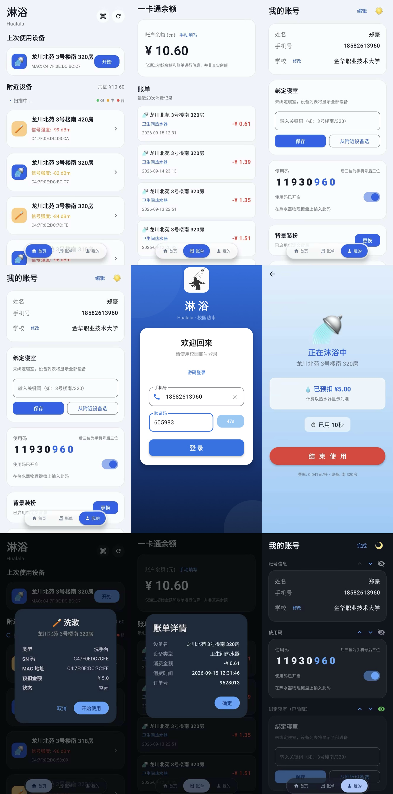
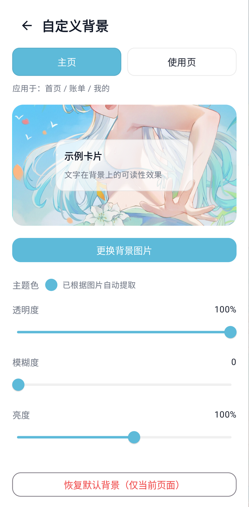
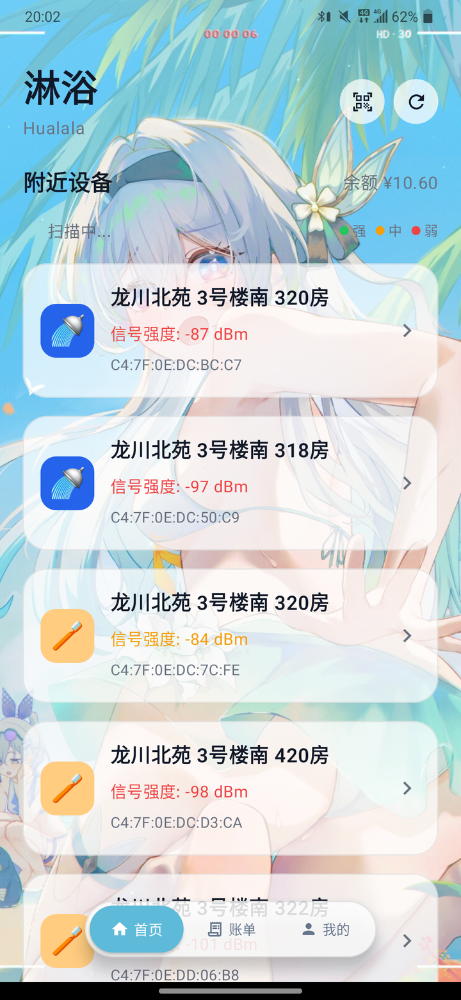
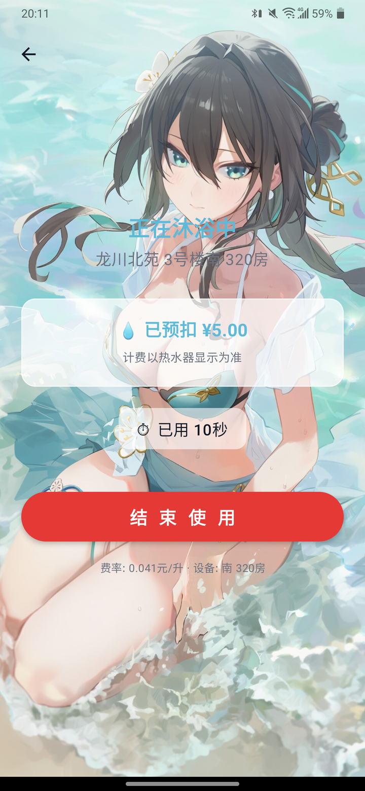
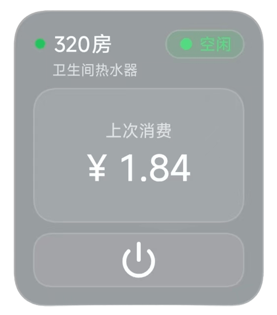
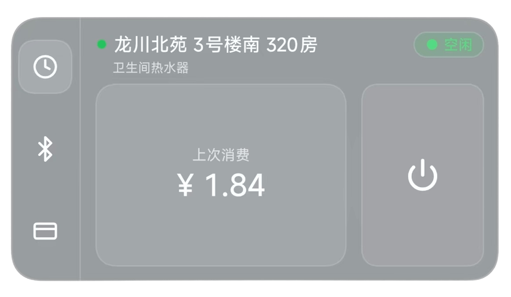
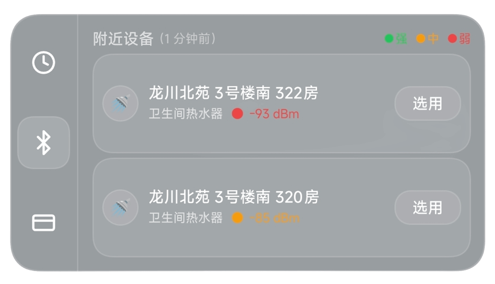
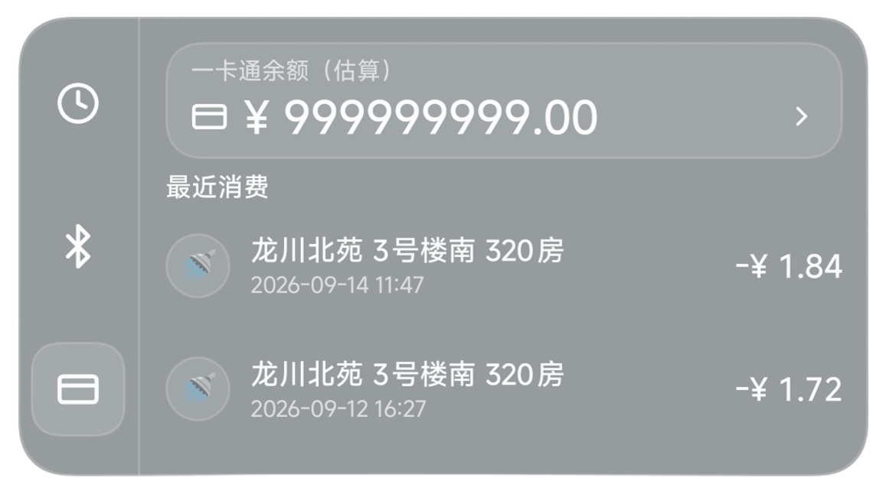

# 🚿 淋浴 (LinYu)

[](https://developer.android.com)
[](https://kotlinlang.org)
[](https://developer.android.com/jetpack/compose)
[](https://github.com/yehu-imei/linyu/releases/latest)
[](LICENSE)

**⬇️ [下载最新 APK (v2.2.1)](https://github.com/yehu-imei/linyu/releases/latest)**

趣智校园第三方 Android 客户端，用于控制校园热水器。相比官方 App，提供更简洁的界面和更流畅的操作体验。

## 📱 预览



### 背景装扮

把喜欢的图片设成界面背景，App 会自动从图里提取主题色作为强调色；主页与使用页各存一套，互不影响。

| 背景设置 | 主页 | 使用页 |
|---|---|---|
|  |  |  |

> 使用页套用自定义背景后不再显示设备 emoji——背景图本身就是画面主体。

### 桌面小组件

在桌面直接启停热水，不用打开 App。

| 2x2 | 2x4 · 设备控制 |
|---|---|
|  |  |

| 2x4 · 附近设备 | 2x4 · 账单 |
|---|---|
|  |  |

## ✨ 功能

### 🚿 设备控制

- 🔐 **手机号登录** — 密码登录 / **短信验证码登录**，支持系统自动填充保存账号密码，登录状态持久化与自动恢复
- 📡 **蓝牙扫描** — BLE 扫描附近设备，按信号强度排序；权限按需申请，Android 12+ 不需要定位权限
- 📷 **扫码绑定** — 扫描设备二维码，直接弹出设备详情，无需蓝牙
- 🔦 **扫码手电筒** — 光线不足时扫码补光
- 🏠 **绑定寝室** — 绑定寝室关键词，设备列表只显示寝室内的设备
- 🚿 **一键洗澡** — 选择设备即可开始，支持停止和恢复；开阀确认，失败有提示
- ⏳ **自动关停倒计时** — 显示闲置自动关闭倒计时，关闭时弹出确认框
- 💰 **消费结算** — 关阀后通过账单自动显示本次消费金额
- 🚰 **饮水机支持（待测试）** — 自动识别直饮水机，绿色主题区分，设备名智能精简
- 🧩 **桌面小组件** — 2x2 / 2x4 两种尺寸，桌面直接启停热水；深色液态玻璃卡片，三套布局随尺寸自适应；计时由系统 Chronometer 驱动，App 不在也能实时走秒
  - 2x4 带侧边导航，可切换「设备控制 / 附近设备 / 账单」三页
  - 操作状态在桌面上**全局同步**：点任一个组件，所有淋浴组件同时显示「正在开启…」并转圈
  - 点「上次消费」卡片进 App 账单页；使用中点计时卡片直接关阀

### 💰 钱包与账单

- 💰 **余额估算** — 手动输入初始余额，根据账单自动扣减
- 📋 **账单查询** — 查看当月消费记录和详情，按设备类型着色

### 🎨 个性化

- 🖼 **背景装扮** — 主页与使用页各一套独立背景，自动提取主题色，支持透明度 / 模糊 / 亮度调节
- 🌓 **深浅主题** — 圆形揭示切换动画，设置自动保存
- 🧩 **卡片自定义** — 「我的」页面卡片可上下排序、隐藏显示
- 📶 **断网提示** — 网络异常时友好提示
- 👥 **挤号检测** — 多设备登录自动提醒，25 秒心跳轮询，被挤下线能及时弹出提示

### 🔧 其他

- 📜 **内置运行日志** — 内存 + 文件双缓冲，敏感信息自动打码，崩溃自动捕获，可一键分享导出
- 🔄 **应用内更新** — 自动读取 GitHub Release 比对版本、展开查看更新日志，并可直接在应用内下载安装
- 🔐 **加密存储** — 登录凭证加密存储（EncryptedSharedPreferences）

## 🏗 架构

```
UI (Compose) → ViewModel → Repository → Retrofit API (v3-api.china-qzxy.cn)
                              ↓
   MQTT / BLE 扫描 / 扫码(CameraX) / 账单结算 / 加密存储 / 日志 / 背景管理
```

| 层级 | 技术 |
|---|---|
| UI | Jetpack Compose + Material 3 |
| 状态管理 | ViewModel + StateFlow / Compose State |
| HTTP | Retrofit 2.9 + OkHttp |
| 实时推送 | Eclipse Paho MQTT |
| 蓝牙 / 扫码 | Android BLE API / CameraX + ML Kit |
| 加密存储 | EncryptedSharedPreferences |
| 日志 | 自研 AppLogger（环形缓冲 + 文件滚动 + 脱敏） |
| 桌面小组件 | AppWidgetProvider + RemoteViews |
| 混淆 | R8 Full Mode |

## 📁 项目结构

```
app/src/main/java/com/hualala/linyu/
├── MainActivity.kt         # 主 Activity（导航、弹窗、边到边、状态栏）
├── QrScanActivity.kt       # 扫码界面 (CameraX + ML Kit + 手电筒)
├── api/                    # 网络层
│   ├── QzxyService.kt      # Retrofit 接口
│   ├── NetworkModule.kt    # OkHttp + 认证拦截器
│   ├── SafeApi.kt          # 手动 JSON 解析 (避 R8 泛型擦除)
│   └── GithubApi.kt        # GitHub Release / 仓库信息（更新检测）
├── data/                   # 数据层
│   ├── AuthRepository.kt   # 登录认证（密码 / 短信）
│   └── ShowerController.kt # 开阀/关阀/结算共享层（App 与小组件共用）
├── model/                  # 数据模型
│   ├── LoginModels.kt      # 含账单设备类型判定（热水器 / 饮水机）
│   ├── DeviceModels.kt     # 含饮水机识别与设备名格式化
│   ├── WidgetCache.kt      # 小组件离线快照（附近设备 / 账单）
│   ├── ActiveOrder.kt
│   └── MqttModels.kt
├── ui/                     # 界面
│   ├── LoginScreen.kt      # 登录（密码 / 短信两种方式）
│   ├── MainScreen.kt       # 主页 + 设备列表 + 扫码
│   ├── ShowerScreen.kt     # 洗澡中 (含自动关停倒计时)
│   ├── WalletScreen.kt     # 钱包 + 账单
│   ├── UserScreen.kt       # 我的（可排序卡片）
│   ├── FloatingPillNavBar.kt    # 悬浮胶囊导航栏（弹簧滑块）
│   ├── AppBackgroundLayer.kt    # 自定义背景渲染层
│   ├── CustomBackgroundScreen.kt# 背景装扮设置页
│   ├── LogViewerDialog.kt       # 内置日志查看器
│   ├── TailEllipsisText.kt      # 尾部优先省略的单行文本（设备名 / MAC）
│   ├── LinYuToast.kt
│   ├── DeviceDetailDialog.kt
│   └── theme/
│       ├── Theme.kt             # 配色方案（液态玻璃卡片）
│       └── CircularRevealTheme.kt # 圆形揭示主题切换
├── widget/                 # 桌面小组件
│   ├── LinYuWidgetProvider.kt # Provider（2x2 / 2x4 共用逻辑）+ 状态推送
│   └── WidgetRenderer.kt      # 状态推断 + RemoteViews 渲染
└── utils/                  # 工具
    ├── PrefsHelper.kt      # 加密存储
    ├── MqttManager.kt      # MQTT 管理
    ├── BluetoothScanner.kt # 蓝牙扫描
    ├── MD5Utils.kt         # 密码加密
    ├── SignUtils.kt        # 短信验证码 secret 计算
    ├── AppLogger.kt        # 日志（脱敏 / 滚动 / 崩溃捕获）
    ├── BackgroundManager.kt# 背景图存取（主页 / 使用页两套）
    ├── BackgroundState.kt  # 背景配置状态
    ├── ScanPermission.kt   # 蓝牙扫描权限（按系统版本分流）
    └── ApkUpdater.kt       # 更新包下载 + 调起安装器
```

res/ 额外包含 `drawable/ic_flashlight.xml`（扫码手电筒图标）、`drawable/app_logo.png`（应用 logo）、
`xml/file_paths.xml`（日志导出 FileProvider）。

小组件相关资源：

```
layout/  widget_linyu_2x2.xml / widget_linyu_2x2_wide.xml / widget_linyu_2x4.xml
xml/     widget_info_2x2.xml / widget_info_2x4.xml
nodpi/   widget_preview_2x2.png / widget_preview_2x4.png   # 组件选择器里的预览图
drawable/ widget_glass / widget_inset / widget_badge_* / widget_btn_* /
          widget_sphere_* / widget_nav_active / widget_avatar
          ic_widget_*.xml                                  # 小组件用的矢量图标
```

## 🚀 构建

### 环境要求

- Android Studio（推荐自带 JBR/JDK 21）
- JDK 17+（实测使用 Android Studio 自带 JBR/JDK 21 构建）
- Android SDK 36
- Gradle 9.4.1

### 生成签名密钥

```bash
keytool -genkey -v -keystore your-key.jks \
  -keyalg RSA -keysize 2048 -validity 10000 -alias your-alias
```

### 配置签名

创建 `local.properties`（已在 `.gitignore` 中）：

```properties
KEYSTORE_FILE=../your-key.jks
KEYSTORE_PASSWORD=你的密码
KEY_ALIAS=你的别名
KEY_PASSWORD=你的密码
```

### 构建 APK

```bash
# Debug
./gradlew assembleDebug

# Release (混淆 + 压缩 + 签名)
# 若因网络无法下载 lint 依赖而失败，可跳过 lint 检查：
./gradlew assembleRelease -x lintVitalRelease
```

## 📖 文档

| 文档 | 说明 |
|---|---|
| [PROJECT.md](PROJECT.md) | 完整项目文档、技术架构、功能清单 |
| [CHANGELOG.md](CHANGELOG.md) | 版本更新日志 |
| [API-qzxy.md](API-qzxy.md) | 趣智校园 API 逆向工程完整参考 |
| [开发者指南.md](开发者指南.md) | 面向第三方开发者的开发指南 |

## 🔧 适配你的学校

趣智校园在各地的部署不一样，按需要的改动量可以分三类。**先直接下载发行版试，能用就不用管下面的内容。**

### ✅ 多数学校：直接装就能用

**projectId 不需要手动填，也不需要抓包。** 它由服务器在登录时下发，客户端自动获取并沿用到后续所有请求——项目里没有硬编码任何学校的 projectId。

短信验证码登录的 `secret` 同理，是按手机号在本地算出来的（见 `utils/SignUtils.kt`），任何学校、任何手机号都能用：

```
secret = MD5( 手机号前3位 + 手机号后4位 + "klcx" )
```

### ⚠️ 部分学校：可用设备类型不同

各校接入的设备不一样，已适配的有三类，App 会自动识别并区分显示：

| 设备 | 识别方式 | 界面表现 |
|---|---|---|
| 热水器 | 蓝牙广播名 `KLCXKJ-Water` | 🚿 蓝色，正在沐浴中 |
| 洗手台 | 设备名以「洗手台」开头 | 🪥 橙色，正在洗漱中 |
| 直饮水机 | `bigTypeId == 5` | ❄️ / ♨️ 绿色，正在接凉水 / 热水 |

如果你们学校的设备名格式特殊（比如不叫「热水器-xxx」），设备名简化和类型识别可能不准，可以在 `model/DeviceModels.kt` 里补规则。

### 🔧 少数学校：需要自行改代码重新编译

只有部署方式与常见情况不同时才需要动，一共两处：

| 位置 | 当前值 | 不改会怎样 |
|---|---|---|
| BLE 设备名过滤 | `KLCXKJ-Water` | 扫不到附近设备（扫码绑定不受影响，仍可用） |
| MQTT 服务器 | `tcp://47.107.37.60:1883` | 收不到实时消费推送（不影响开关阀，HTTP 轮询仍正常） |

改完自行编译即可，构建方法见上方「构建」章节。

---

## ⚠️ 已知问题与限制

### ✅ 已修复

| 原问题 | 状态 |
|---|---|
| ~~短信登录 secret 绑定账号~~ | ✅ **已解决 (v2.1.0)**：secret 由手机号推导，任何手机号可用 |
| ~~被挤号后重新登录又被弹出、需要登两次~~ | ✅ **已解决 (v2.2.0)**：旧会话在途请求会清掉新会话凭证，改为会话级作用域整体取消 |
| ~~热水器自动关停无感知~~ | ✅ **已解决 (v1.2.0)**：解析 `autoDisConTime` 显示闲置倒计时，自动关闭时弹确认框 |
| ~~关闭失败无提示~~ | ✅ **已解决 (v1.2.0)**：关阀后通过 `closeOrderResult` 确认，失败会提示重试 |
| ~~切到「我的」页面卡顿~~ | ✅ **已解决 (v2.1.0)**：卡片顺序 / Release 数据改为进程级缓存 |
| ~~设备名残留「表」字~~ | ✅ **已解决 (v2.1.0)**：修正正则处理顺序，`热水表-xxx` 不再被截成 `表 xxx` |
| ~~使用页退出按钮点击无响应~~ | ✅ **已解决 (v2.1.0)**：修正组件层级，按钮不再被上层 Column 拦截点击 |
| ~~小组件按钮点了没反应~~ | ✅ **已解决 (v2.2.1)**：PendingIntent 指向了未注册的组件，广播被系统静默丢弃 |
| ~~2x2 拉宽后显示「载入窗口小部件时出现问题」~~ | ✅ **已解决 (v2.2.1)**：给 ImageView 调了 `setTextViewText`，RemoteViews 反射找不到方法 |
| ~~附近设备页必崩~~ | ✅ **已解决 (v2.2.1)**：旧缓存 JSON 缺字段，Gson 绕过 Kotlin 非空约定给出 null |
| ~~首页设备名过长会盖到按钮上~~ | ✅ **已解决 (v2.2.1)**：测量省略号宽度时漏算了主题字距，已修正并改为不换行 |
| ~~Android 12+ 被迫要定位权限~~ | ✅ **已解决 (v2.2.0)**：`BLUETOOTH_SCAN` 声明 `neverForLocation`，且改由用户主动触发申请 |

### ❌ 仍未解决

| 问题 | 说明 |
|---|---|
| **挤号检测有延迟** | 靠心跳轮询实现，被挤下线最多 25 秒后才提示 |
| **无实时扣费** | MQTT 仅在订单结束时推送消费金额，洗澡中看不到实时扣费。官方 App 也是如此 |
| **消费金额结算延迟** | 账单生成有延迟，最长需等待约 20 秒 |
| **一卡通余额无法获取** | 易校园 API 有 HMAC-SHA256 native 签名保护，只能手动估算余额 |
| **小组件不显示实时消费** | 小组件不连 MQTT，使用中只显示预扣金额；停止后也不做账单结算，回 App 才会显示 |

### 🏫 兼容性

| 问题 | 说明 |
|---|---|
| **各校部署有差异** | 已在多所学校被实际使用，但各校接入的设备类型、BLE 广播名、MQTT 地址可能不同。多数学校装发行版即可，少数需要自行改代码 |
| **饮水机功能未实机验证** | 饮水机识别与 UI 已实现，但作者所在学校无直饮水机，实际控制流程未验证 |
| **Android 11 及以下仍需定位权限** | 系统对蓝牙发现的硬性规定，无法绕过；引导卡片里说明了原因 |
| **自动填充依赖手机密码管理器** | 不同厂商 ROM 行为差异较大，未在多数机型上验证 |

### 🔒 安全

| 问题 | 说明 |
|---|---|
| **MQTT 明文** | 趣智校园 MQTT 服务器不支持 TLS，通信内容未加密 |
| **密码 MD5** | 趣智校园使用 MD5 取后 10 位，安全性低（官方协议限制） |

### 🎨 体验

| 问题 | 说明 |
|---|---|
| **深色模式不完整** | 登录页和洗澡页为硬编码颜色切换，非完全跟随系统 |
| **仅中文界面** | 无多语言支持 |

> 欢迎提 Issue 或 PR 帮助改进！

## 📄 许可证

[MIT License](LICENSE)

## ⚖️ 免责声明

本项目仅供学习和研究用途。使用者应自行遵守趣智校园及相关服务的使用条款。开发者不对因使用本项目产生的任何后果承担责任。
