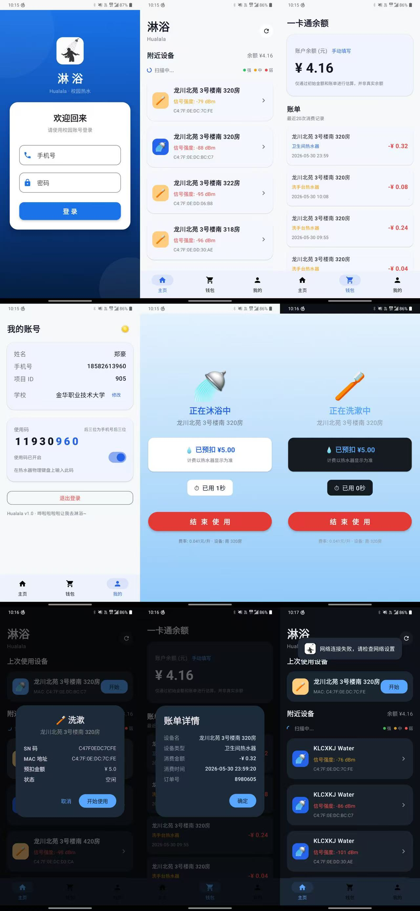

# 🚿 淋浴 (LinYu)

[](https://developer.android.com)
[](https://kotlinlang.org)
[](https://developer.android.com/jetpack/compose)
[](LICENSE)

趣智校园第三方 Android 客户端，用于控制校园热水器（淋浴设备）。相比官方 App，提供更简洁的界面和更流畅的操作体验。

## 📱 预览



## ✨ 功能

- 🔐 **手机号登录** — 支持登录状态持久化和自动恢复
- 📡 **蓝牙扫描** — BLE 扫描附近热水器，按信号强度排序
- 🚿 **一键洗澡** — 选择设备即可开始，支持停止和恢复
- 💰 **余额估算** — 手动输入初始余额，根据账单自动扣减
- 📋 **账单查询** — 查看当月消费记录和详情
- 🔢 **使用码** — 显示/远程开关热水器使用码
- 🌓 **深浅主题** — 手动切换，设置自动保存
- 📶 **断网提示** — 网络异常时友好提示
- 👥 **挤号检测** — 多设备登录自动提醒

## 🏗 架构

```
UI (Compose) → ViewModel → Repository → Retrofit API
                              ↓
                    MQTT / BLE / PrefsHelper
```

| 层级 | 技术 |
|---|---|
| UI | Jetpack Compose + Material 3 |
| 状态管理 | ViewModel + StateFlow |
| HTTP | Retrofit 2.9 + OkHttp |
| 实时推送 | Eclipse Paho MQTT |
| 蓝牙 | Android BLE API |
| 混淆 | R8 Full Mode |

## 📁 项目结构

```
app/src/main/java/com/hualala/linyu/
├── api/                    # 网络层
│   ├── QzxyService.kt      # Retrofit 接口 (11 个 API)
│   ├── NetworkModule.kt    # OkHttp + 认证拦截器
│   └── SafeApi.kt          # 手动 JSON 解析 (避 R8 泛型擦除)
├── data/                   # 数据层
│   └── AuthRepository.kt   # 登录认证
├── model/                  # 数据模型
│   ├── LoginModels.kt
│   ├── DeviceModels.kt
│   ├── ActiveOrder.kt
│   └── MqttModels.kt
├── ui/                     # 界面
│   ├── LoginScreen.kt      # 登录
│   ├── MainScreen.kt       # 主页 + 设备列表
│   ├── ShowerScreen.kt     # 洗澡中
│   ├── WalletScreen.kt     # 钱包 + 账单
│   ├── UserScreen.kt       # 用户 + 使用码
│   └── theme/Theme.kt      # 主题
└── utils/                  # 工具
    ├── PrefsHelper.kt      # 本地存储
    ├── MqttManager.kt      # MQTT 管理
    ├── BluetoothScanner.kt # 蓝牙扫描
    └── MD5Utils.kt         # 密码加密
```

## 🚀 构建

### 环境要求

- Android Studio Hedgehog+
- JDK 11+
- Android SDK 36
- Gradle 9.4.1

### 生成签名密钥

```bash
keytool -genkey -v -keystore your-key.jks \
  -keyalg RSA -keysize 2048 -validity 10000 -alias your-alias
```

### 配置签名

创建 `local.properties`（已在 `.gitignore` 中）：

```properties
KEYSTORE_FILE=../your-key.jks
KEYSTORE_PASSWORD=你的密码
KEY_ALIAS=你的别名
KEY_PASSWORD=你的密码
```

### 构建 APK

```bash
# Debug
./gradlew assembleDebug

# Release (混淆 + 压缩 + 签名)
./gradlew assembleRelease
```

## 📖 文档

| 文档 | 说明 |
|---|---|
| [PROJECT.md](PROJECT.md) | 完整项目文档、技术架构、功能清单 |
| [API-qzxy.md](API-qzxy.md) | 趣智校园 API 逆向工程完整参考 |
| [开发者指南.md](开发者指南.md) | 面向第三方开发者的开发指南 |

## 🔧 适配你的学校

不同学校的 `projectId` 不同，需要自行抓包获取：

1. 安装抓包工具（Reqable + LSPosed + TrustMeAlready）
2. 登录官方趣智校园 App 并抓包
3. 从 `/user/login` 响应中获取 `userAccount.projectId`
4. 在代码中替换 projectId 和设备名过滤规则

## ⚠️ 已知限制

- 一卡通余额无法获取（易校园 API 有 HMAC-SHA256 签名保护）
- MQTT 通信为明文（趣智校园服务器不支持 TLS）
- 密码传输使用 MD5 后 10 位（官方协议限制，无法改变）
- 不同学校需要适配 projectId

## 📄 许可证

[MIT License](LICENSE)

## ⚖️ 免责声明

本项目仅供学习和研究用途。使用者应自行遵守趣智校园及相关服务的使用条款。开发者不对因使用本项目产生的任何后果承担责任。
