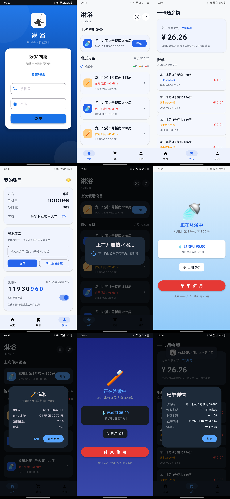

# 🚿 淋浴 (LinYu)

[](https://developer.android.com)
[](https://kotlinlang.org)
[](https://developer.android.com/jetpack/compose)
[](https://github.com/yehu-imei/linyu/releases/latest)
[](LICENSE)

**⬇️ [下载最新 APK (v1.2.0)](https://github.com/yehu-imei/linyu/releases/latest)**

趣智校园第三方 Android 客户端，用于控制校园热水器。相比官方 App，提供更简洁的界面和更流畅的操作体验。

## 📱 预览



## ✨ 功能

- 🔐 **手机号登录** — 支持登录状态持久化和自动恢复
- 📡 **蓝牙扫描** — BLE 扫描附近热水器，按信号强度排序
- 📷 **扫码绑定** — 扫描热水器二维码，直接弹出设备详情，无需蓝牙
- 🔦 **扫码手电筒** — 光线不足时扫码补光
- 🏠 **绑定寝室** — 绑定寝室关键词，设备列表只显示寝室内的设备
- 🚿 **一键洗澡** — 选择设备即可开始，支持停止和恢复；开阀确认，失败有提示
- ⏳ **自动关停倒计时** — 显示闲置自动关闭倒计时，关闭时弹出确认框
- 💰 **消费结算** — 关阀后通过账单自动显示本次消费金额
- 💰 **余额估算** — 手动输入初始余额，根据账单自动扣减
- 📋 **账单查询** — 查看当月消费记录和详情
- 🔢 **使用码** — 显示/远程开关热水器使用码
- 🌓 **深浅主题** — 手动切换，设置自动保存
- 🔐 **加密存储** — 登录凭证加密存储（EncryptedSharedPreferences）
- 📶 **断网提示** — 网络异常时友好提示
- 👥 **挤号检测** — 多设备登录自动提醒

## 🏗 架构

```
UI (Compose) → ViewModel → Repository → Retrofit API (v3-api.china-qzxy.cn)
                              ↓
          MQTT / BLE 扫描 / 扫码(CameraX) / 账单结算 / 加密存储
```

| 层级 | 技术 |
|---|---|
| UI | Jetpack Compose + Material 3 |
| 状态管理 | ViewModel + StateFlow |
| HTTP | Retrofit 2.9 + OkHttp |
| 实时推送 | Eclipse Paho MQTT |
| 蓝牙 / 扫码 | Android BLE API / CameraX + ML Kit |
| 加密存储 | EncryptedSharedPreferences |
| 混淆 | R8 Full Mode |

## 📁 项目结构

```
app/src/main/java/com/hualala/linyu/
├── MainActivity.kt         # 主 Activity
├── QrScanActivity.kt       # 扫码界面 (CameraX + ML Kit + 手电筒)
├── api/                    # 网络层
│   ├── QzxyService.kt      # Retrofit 接口 (16 个 API)
│   ├── NetworkModule.kt    # OkHttp + 认证拦截器
│   └── SafeApi.kt          # 手动 JSON 解析 (避 R8 泛型擦除)
├── data/                   # 数据层
│   └── AuthRepository.kt   # 登录认证
├── model/                  # 数据模型
│   ├── LoginModels.kt
│   ├── DeviceModels.kt
│   ├── ActiveOrder.kt
│   └── MqttModels.kt
├── ui/                     # 界面
│   ├── LoginScreen.kt      # 登录
│   ├── MainScreen.kt       # 主页 + 设备列表 + 扫码
│   ├── ShowerScreen.kt     # 洗澡中 (含自动关停倒计时)
│   ├── WalletScreen.kt     # 钱包 + 账单
│   ├── UserScreen.kt       # 用户 + 使用码 + 绑定寝室
│   └── theme/Theme.kt      # 主题
└── utils/                  # 工具
    ├── PrefsHelper.kt      # 加密存储 (EncryptedSharedPreferences)
    ├── MqttManager.kt      # MQTT 管理
    ├── BluetoothScanner.kt # 蓝牙扫描
    └── MD5Utils.kt         # 密码加密
```

res/ 额外包含 `drawable/ic_flashlight.xml`（扫码手电筒图标）、`drawable/app_logo.png`（应用 logo）。

## 🚀 构建

### 环境要求

- Android Studio（推荐自带 JBR/JDK 21）
- JDK 17+（实测使用 Android Studio 自带 JBR/JDK 21 构建）
- Android SDK 36
- Gradle 9.4.1

### 生成签名密钥

```bash
keytool -genkey -v -keystore your-key.jks \
  -keyalg RSA -keysize 2048 -validity 10000 -alias your-alias
```

### 配置签名

创建 `local.properties`（已在 `.gitignore` 中）：

```properties
KEYSTORE_FILE=../your-key.jks
KEYSTORE_PASSWORD=你的密码
KEY_ALIAS=你的别名
KEY_PASSWORD=你的密码
```

### 构建 APK

```bash
# Debug
./gradlew assembleDebug

# Release (混淆 + 压缩 + 签名)
# 若因网络无法下载 lint 依赖而失败，可跳过 lint 检查：
./gradlew assembleRelease -x lintVitalRelease
```

## 📖 文档

| 文档 | 说明 |
|---|---|
| [PROJECT.md](PROJECT.md) | 完整项目文档、技术架构、功能清单 |
| [API-qzxy.md](API-qzxy.md) | 趣智校园 API 逆向工程完整参考 |
| [开发者指南.md](开发者指南.md) | 面向第三方开发者的开发指南 |

## 🔧 适配你的学校

本项目仅在**金华职业技术大学（projectId=905）**的男生宿舍测试过，其他学校使用前需要修改以下内容：

### 1. 短信登录 secretKey（未完善功能）

⚠️ **短信验证码登录目前是「未完善功能」**：`getVerificationCode` 接口的 `secret` 参数（`QzxyService.kt` 硬编码）经测试**绑定账号**，其他手机号无法用同一 secret 发验证码。

- 默认请使用**手机号 + 密码登录**（密码登录不需要 secret，已验证正常）
- 短信登录需自行逆向官方 App 获取与自己账号匹配的 secret 后替换（见下）

如需尝试，获取 secret 的方法：

```
1. 安装 Reqable + LSPosed + TrustMeAlready（绕过 SSL Pinning）
2. 打开官方趣智校园 App，点击"发送验证码"
3. 在 Reqable 中找到 /user/verification/code/get 请求
4. 复制 URL 中 secret 参数的值
5. 替换 QzxyService.kt 第 113 行的 secret 默认值
```

> 💡 由于 secret 绑定账号，此方式仅对抓包者本人的账号有效，不是通用的短信登录方案。

### 2. 修改 projectId

每所学校的 projectId 不同，从 `/user/login` 响应的 `userAccount.projectId` 获取。

### 3. 可能需要修改的位置

| 位置 | 当前值 | 说明 |
|---|---|---|
| `projectId` | 905 | 学校唯一标识 |
| BLE 设备名过滤 | `KLCXKJ-Water` | 热水器蓝牙广播名 |
| MAC 地址前缀 | `C4:7F:0E` | 凯路创新科技厂商码 |
| MQTT 服务器 | `tcp://47.107.37.60:1883` | 不同学校可能不同 |

---

## ⚠️ 已知问题与限制

### 🚿 洗澡相关

| 问题 | 说明 |
|---|---|
| ~~热水器自动关停无感知~~ | ✅ **已解决 (v1.2.0)**：解析 `autoDisConTime` 显示闲置倒计时；自动关闭时弹出确认框（设备名 + 时长 + 消费金额） |
| ~~关闭失败无提示~~ | ✅ **已解决 (v1.2.0)**：关阀后通过 `closeOrderResult` 确认，失败会提示重试 |
| **无实时扣费** | MQTT 仅在订单结束时推送消费金额，洗澡中看不到实时扣费。官方 App 也是如此 |

### 🏫 兼容性

| 问题 | 说明 |
|---|---|
| **仅在一所学校测试** | 只在金华职业技术大学（projectId=905）男生宿舍测试过几次，其他学校能否使用未知 |
| **短信登录未完善** | 短信验证码接口的 `secret` 绑定账号，其他人无法使用同一 secret；请用密码登录 |
| **一卡通余额无法获取** | 易校园 API 有 HMAC-SHA256 native 签名保护，只能手动估算余额 |

### 🔒 安全

| 问题 | 说明 |
|---|---|
| **MQTT 明文** | 趣智校园 MQTT 服务器不支持 TLS，通信内容未加密 |
| **密码 MD5** | 趣智校园使用 MD5 取后 10 位，安全性低（官方协议限制） |

### 🎨 体验

| 问题 | 说明 |
|---|---|
| **深色模式不完整** | 登录页和洗澡页为硬编码颜色切换，非完全跟随系统 |
| **仅中文界面** | 无多语言支持 |

> 欢迎提 Issue 或 PR 帮助改进！

## 📄 许可证

[MIT License](LICENSE)

## ⚖️ 免责声明

本项目仅供学习和研究用途。使用者应自行遵守趣智校园及相关服务的使用条款。开发者不对因使用本项目产生的任何后果承担责任。
